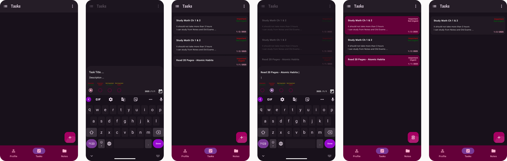

# 📱 Momentive

**Momentive** = *Momentum* + *Active*

> A personal productivity mobile application built using **Kotlin** and **Jetpack Compose**, designed to help you stay focused, organized, and proactive in achieving your goals.

---

## 🚀 Overview

**Momentive** is a work-in-progress app dedicated to improving your daily productivity and mental clarity. Whether you're managing tasks, jotting down thoughts, or evaluating your long-term goals, Momentive will serve as your companion on the journey toward intentional living.

---

## 🛠 Planned Features

- ✅ **Task Management** (In progress)  
- 🔐 **Authentication** (Not completed)  
- 📝 **Notes Management** (Not completed)  
- 💭 **Thoughts Collector** (Not completed)  
- 🎯 **Goals Evaluation (SMART)** (Not completed)

---

## 🎨 UI Preview

Here’s a sneak peek at the prototype for the **Task Management** feature, designed using **Figma**:

---

## 📦 Tech Stack

- Kotlin  
- Jetpack Compose  
- Material 3  
- MVVM Architecture  

---

## 🚧 Project Status

Momentive is still under active development. Contributions and feedback are welcome as the project continues to evolve.
